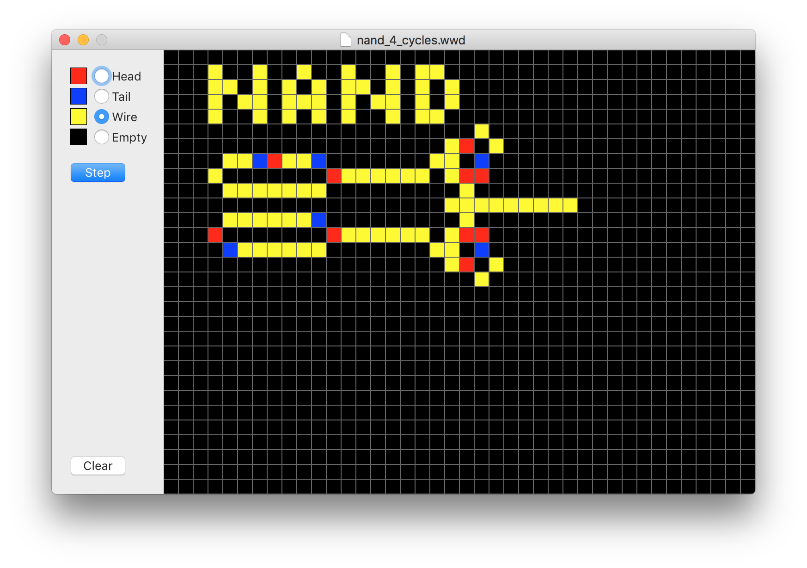

# Wireworld
A simple Wireworld cellular automaton explorer in Swift

> Wireworld is a cellular automaton first proposed by Brian Silverman in 1987. Wireworld is particularly suited to simulating electronic logic elements, or "gates", and, despite the simplicity of the rules, Wireworld is Turing-complete.

> [https://en.wikipedia.org/wiki/Wireworld](https://en.wikipedia.org/wiki/Wireworld)

Cells have four possible states, which evolve as follows:

- empty -> empty
- head -> tail
- tail -> wire
- wire -> if 1 or 2 heads among neighbours then head, else wire

Wireworld can be used to build logic gates and, from there, [The Wireworld computer](https://www.quinapalus.com/wi-index.html).

Download: [wireworld\_0\_1.zip](http://www.seriot.ch/wireworld/wireworld_0_1.zip) (2.6 MB)

